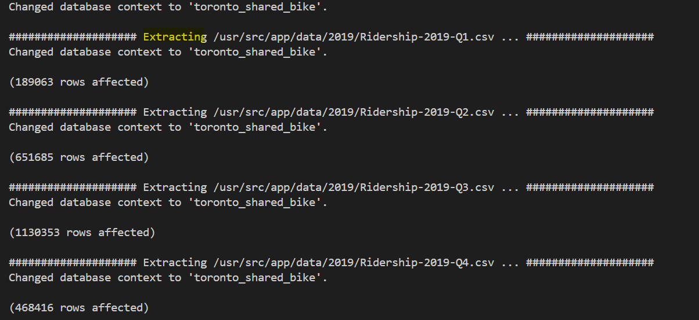
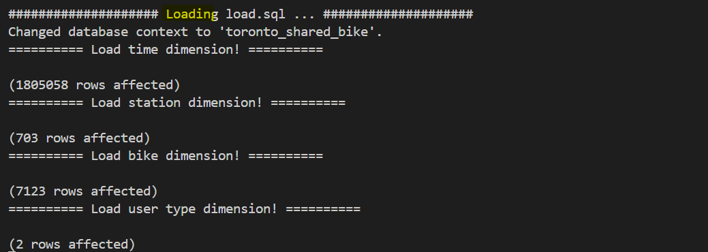

# Toronto Shared Bike Data Warehouse Project - SQL Server + Power BI Solution

A data warehouse project of Toronto Shared Bike using SQL Server & Power BI.

- [Toronto Shared Bike Data Warehouse Project - SQL Server + Power BI Solution](#toronto-shared-bike-data-warehouse-project---sql-server--power-bi-solution)
	- [Data Warehouse](#data-warehouse)
		- [Logical Design](#logical-design)
		- [Physical Implementation](#physical-implementation)
		- [Connect with MSSQL](#connect-with-mssql)
		- [ETL Pipeline](#etl-pipeline)
		- [Confirm](#confirm)
	- [Data Visualization: Power BI](#data-visualization-power-bi)

---

## Data Warehouse

- Data Source:
  - https://open.toronto.ca/dataset/bike-share-toronto-ridership-data/

### Logical Design


---

### Physical Implementation

- Initialize MSSQL Instance

```sh
cd mssql
docker compose up -d
```

---

### Connect with MSSQL

- Connection


- Tables & views


---

### ETL Pipeline

- Extract

```sh
docker exec -it mssql bash /usr/src/app/script/etl/extract.sh
```



- Transform

```sh
docker exec -it mssql bash /usr/src/app/script/etl/transform.sh
```


- Load

```sh
docker exec -it mssql bash /usr/src/app/script/etl/load.sh
```



---

### Confirm

- Time dimension

```sh
SELECT
	dim_year
	, dim_month
	, dim_hour
	, dim_user
	, trip_count
	, duration_sum
FROM TorontoSharedBikeDB.dw_schema.mv_user_time
ORDER BY dim_year, dim_month, dim_hour, dim_user
```


- Station dimension

```sh
SELECT
	dim_year
	, dim_user
	, dim_station
	, trip_count
FROM TorontoSharedBikeDB.dw_schema.mv_user_station
ORDER BY dim_year, dim_user, trip_count DESC
```


---

## Data Visualization: Power BI

- Connect with SQL Server


- Import Data model


- Dashboard Design


- Publish Dashboard


- Embedded with GitHub Page
  - https://simonangel-fong.github.io/SQL-Server-Toronto_Shared-Bike/


